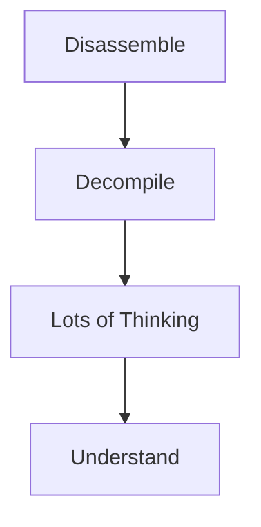

# Reverse Engineering - Real-world Applications

## License Checkers

Back in the stone ages, developers had to make software installable without internet access. How would the developer know the software is legitimate? License key checks

License key checks:
- Have an algorithm that takes an input, perform some calculations, and validate the result
- Ideally the company can generate multiple valid keys
- Ideally pirates can't generate valid keys.
## The Rise of Keygens

Hacker, reverse engineers, and pirates who want to pirate the software would reverse engineer the license keys and be able to create valid keys with a keygen. 

Many took pride when making these reverse engineering out of passion.

## Simple Example

`crackme`'s are small programs designed to test a hackers reverse engineering skills. Inspired by real-world license key verification.

## Alternatives to Keygens

With Internet access (and increased ability to have unbreakable server-side license key checks), keygenning diminished in viability.

Alternatives:
1. Cracks that patch the executable to remove the check altogether (but what to crack?)
2. Legally purchasing the software.

Left on 7:50